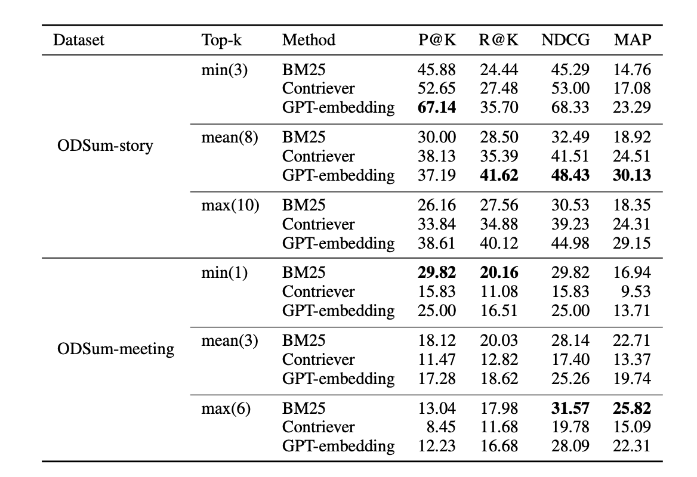
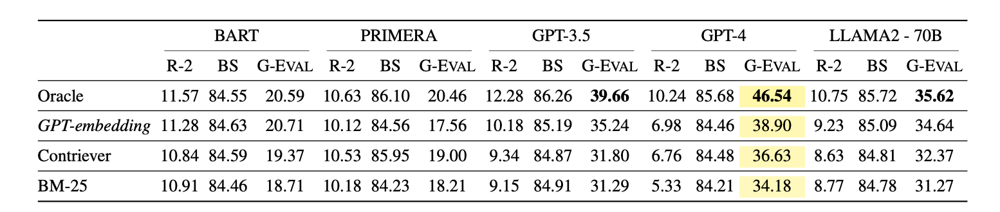
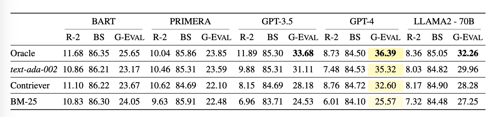

# ODSum

## Overview

ODSum introduces a benchmark for the task of Open Domain Multi-Document Summarization. This work is a result of collaborative research between Zhejiang University and Yale University.

The full details of the benchmarks and methodologies can be found in the [official paper](https://arxiv.org/pdf/2309.08960.pdf) authored by Yijie Zhou, Kejian Shi, Wencai Zhang, Yixin Liu, Yilun Zhao, and Arman Cohan.

## Dataset

The ODSum dataset is designed to evaluate the performance of modern summarization models in multi-document contexts spanning an open domain.

### Dataset Statistics


### Dataset Structure

##### Story

You can access the raw documents and queries paired with summaries in the `data/story/raw` folder. The `data/story/oracle` folder associates these queries with their respective 'ground truth' articles.

For the retrieval part, three distinct strategies are provided:

- Sparse Retrieval (`data/story/sparse`)
- Dense Retrieval (`data/story/dense`)
- LLM-Embedding Retrieval (`data/story/LLM-embedding`)

Each of these retrieval folders contains three sub-versions:

- `min`: Contains the least number of retrieved documents based on relevancy.
- `mean`: An average number of retrieved documents.
- `max`: Contains the maximum number of documents deemed relevant by the retriever.

**Files in each folder**:

- **Raw Data**:
  - `documents`: Contains the stories or documents.
  - `queries`: Paired queries with four human-written summaries. There is no clear relationship between the query and the story in this raw form.
- **Oracle Data**:
  - Maps each query to its corresponding 'ground truth' articles.
- **Retrieval Data** (Applies to `sparse`, `dense`, and `LLM-embedding`):
  - `min`: Data with the minimum number of retrieved documents.
  - `mean`: Data with an average number of retrieved documents.
  - `max`: Data with the maximum number of retrieved documents based on their relevancy.

**Note**: The retrievers rank the documents based on their relevancy to the query, and they select the most relevant few. The number of retrieved documents is variable, depending on the retrieval strategy and the version (min, mean, max).

## Models

**BART**
Description: A sequence-to-sequence Transformer pre-trained using both a sentence permutation and text infilling objective.
Checkpoint & Training: Used the *BART-Large* variant fine-tuned on the CNN/DailyMail dataset. It's further fine-tuned on ODSum with AdamW optimizer, utilizing a unique input format that merges queries and documents.
Limitation: Due to a restricted context length of 1024 tokens, BART serves as a baseline model.
**PRIMERA**
Description: Designed explicitly for multi-document summarization, PRIMERA simplifies the processing of concatenated documents using efficient encoder-decoder transformers.
Implementation: Fine-tuned on each ODSum setting. With a max input length of 4K tokens, documents are truncated to fit within this constraint.
**GPT**
Description: A well-known language model from OpenAI with proven efficacy in text summarization.
Variants & Training: Employed both *gpt-3.5-16k-turbo-0613* and *gpt-4-0613* versions. Special prompts were crafted to guide GPT in summarization, emphasizing the placement of queries at articles' ends for better output.

Limitation: Stories and meetings had to be truncated to match GPT's max token limit.
**Llama-2**
Description: An expansive series of auto-regressive text models renowned for capabilities from logical reasoning to text generation.

Checkpoint: Utilized the *Llama-2-70b-Chat* variant, which is particularly optimized for dialog contexts. For efficiency during inference, 4-bit NF4 quantization is employed.


## Data Processing

To process the data and convert it into formats compatible with various summarization models, refer to `data_process.ipynb`

## Experimental Results

Retrieval Peformance




Summarization Performance for ODSum-story




Summarization Performance for ODSum-meeting



## Citation

If you use the ODSum dataset in your work, please kindly cite the following:

```
@article{zhou2023odsum,
   title={ODSUM: New Benchmarks for Open Domain Multi-Document Summarization},
   author={Zhou, Yijie and Shi, Kejian and Zhang, Wencai and Liu, Yixin and Zhao, Yilun and Cohan, Arman},
   journal={arXiv preprint arXiv:2309.08960},
   year={2023}
}
```

## Contacts

For any queries or issues related to ODSum, please contact:
- Yijie Zhou: e.j.zhou@zju.edu.cn
- Kejian Shi: kejian.shi@yale.edu
